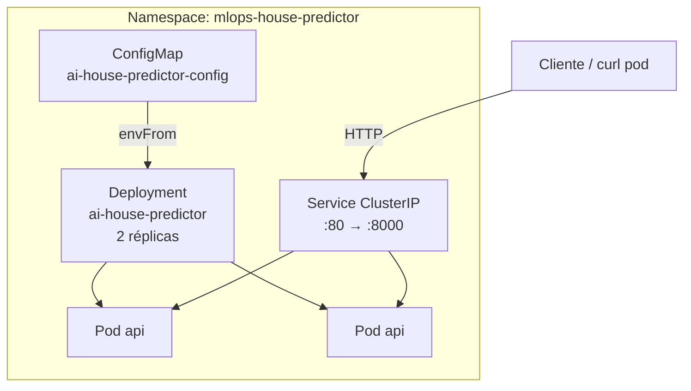

# SPRINT2_REPORT.md

**Proyecto:** MLOps GitOps — TFM UNIR  
**Sprint:** 2 — Despliegue Kubernetes con Kustomize  
**Fecha:** 29 de junio de 2026  
**Alcance:** Manifiestos declarativos, validación en clúster local (sin Argo CD / GitOps)

---

## 1. Arquitectura Kubernetes implementada



### Componentes

| Recurso | API Version | Propósito |
|---|---|---|
| Namespace | v1 | Aislamiento lógico `mlops-house-predictor` |
| ConfigMap | v1 | Configuración de la app (paths, puerto, entorno) |
| Deployment | apps/v1 | API de inferencia con 2 réplicas |
| Service | v1 | Exposición interna ClusterIP |
| Secret (ejemplo) | v1 | Plantilla para credenciales futuras (no aplicado) |

### Flujo de tráfico

1. El **Service** `ai-house-predictor` expone el puerto **80** dentro del clúster.
2. El tráfico se enruta al **targetPort** `http` (8000) de los Pods.
3. Cada Pod ejecuta `uvicorn app.main:app` con variables desde **ConfigMap**.
4. El modelo ML se carga desde el filesystem del contenedor (`/app/app/models/`).

---

## 2. Recursos creados

### Estructura Kustomize

```
Config/
├── base/
│   ├── namespace.yaml
│   ├── deployment.yaml
│   ├── service.yaml
│   ├── configmap.yaml
│   ├── secret.example.yaml
│   └── kustomization.yaml
└── overlays/
    ├── dev/
    │   ├── kustomization.yaml
    │   ├── deployment-patch.yaml
    │   └── configmap-patch.yaml
    └── prod/
        ├── kustomization.yaml
        ├── deployment-patch.yaml
        └── configmap-patch.yaml
```

### Diferencias por overlay

| Aspecto | base | dev | prod |
|---|---|---|---|
| Namespace | `mlops-house-predictor` | `mlops-house-predictor-dev` | `mlops-house-predictor-prod` |
| Réplicas | 2 | 1 | 2 |
| Image tag | `1.0.0` | `dev` | `1.0.0` |
| LOG_LEVEL | `info` | `debug` | `warning` |
| CPU request | 100m | 100m | 200m |
| Memory limit | 512Mi | 512Mi | 768Mi |

---

## 3. Decisiones técnicas tomadas

| Decisión | Justificación |
|---|---|
| **Kustomize** en lugar de Helm | Alineado con restricciones del sprint; nativo en `kubectl`, preparado para Argo CD |
| **ClusterIP** | Servicio interno; Ingress/LoadBalancer en fase posterior |
| **ConfigMap para toda la config** | Externalización completa; compatible con GitOps y overlays |
| **Secret solo como ejemplo** | Sin credenciales reales en Git; preparado para Sealed Secrets en Sprint 3 |
| **UID/GID 999** | Coherente con usuario non-root del Dockerfile |
| **Probes separados** | `/health` liveness + startup; `/ready` readiness con validación de modelo |
| **RollingUpdate 0 maxUnavailable** | Cero downtime durante actualizaciones |
| **imagePullPolicy: IfNotPresent** | Permite despliegue local sin registry |
| **Réplicas base = 2** | Alta disponibilidad mínima para demostración productiva |

---

## 4. Buenas prácticas aplicadas

- Labels estándar `app.kubernetes.io/*` en todos los recursos.
- Annotations descriptivas en Deployment y Service.
- `securityContext` a nivel Pod y contenedor (`runAsNonRoot`, `runAsUser: 999`, `fsGroup: 999`).
- `capabilities.drop: [ALL]`, `allowPrivilegeEscalation: false`.
- `seccompProfile: RuntimeDefault`.
- `automountServiceAccountToken: false`.
- Requests y limits de CPU/memoria definidos.
- `revisionHistoryLimit: 5` para rollback controlado.
- Separación base/overlays para multi-entorno.
- `.gitignore` para artefactos temporales de validación (kubeconfig, tar).

---

## 5. Evidencias de validación

### 5.1 Kustomize build

```text
kubectl kustomize Config/base   → OK
kubectl kustomize Config/overlays/dev   → OK
kubectl kustomize Config/overlays/prod  → OK
```

### 5.2 Docker image

```text
docker build -t ai-house-predictor:1.0.0 .
→ Successfully tagged ai-house-predictor:1.0.0
```

### 5.3 Clúster de validación

Se utilizó **k3s v1.31.5** en contenedor Docker local para validación end-to-end.

### 5.4 `kubectl apply -k`

```text
$ kubectl apply -k Config/base

namespace/mlops-house-predictor created
configmap/ai-house-predictor-config created
service/ai-house-predictor created
deployment.apps/ai-house-predictor created
```

### 5.5 `kubectl get pods`

```text
NAME                                  READY   STATUS    RESTARTS   AGE
ai-house-predictor-8669974cc6-7xsqm   1/1     Running   0          31s
ai-house-predictor-8669974cc6-ft2tp   1/1     Running   0          31s
```

### 5.6 `kubectl get deployments`

```text
NAME                 READY   UP-TO-DATE   AVAILABLE   AGE
ai-house-predictor   2/2     2            2           31s
```

### 5.7 `kubectl get svc`

```text
NAME                 TYPE        CLUSTER-IP      EXTERNAL-IP   PORT(S)   AGE
ai-house-predictor   ClusterIP   10.43.226.116   <none>        80/TCP    31s
```

### 5.8 `kubectl describe deployment` (extracto)

```text
Replicas:               2 desired | 2 updated | 2 total | 2 available
StrategyType:           RollingUpdate
RollingUpdateStrategy:  0 max unavailable, 1 max surge
Image:                  ai-house-predictor:1.0.0
Liveness:               http-get http://:http/health
Readiness:              http-get http://:http/ready
Startup:                http-get http://:http/health
Environment Variables from: ai-house-predictor-config ConfigMap
```

### 5.9 `kubectl rollout status`

```text
Waiting for deployment "ai-house-predictor" rollout to finish: 0 of 2 updated replicas are available...
Waiting for deployment "ai-house-predictor" rollout to finish: 1 of 2 updated replicas are available...
deployment "ai-house-predictor" successfully rolled out
```

### 5.10 `kubectl rollout history`

```text
REVISION  CHANGE-CAUSE
1         <none>
```

---

## 6. Verificación funcional de la API

### Dentro del clúster (curl pod → Service)

| Endpoint | Respuesta |
|---|---|
| `GET /health` | `{"status":"healthy"}` |
| `GET /ready` | `{"status":"ready","model_loaded":true,"model_version":"v1"}` |
| `GET /model` | `{"model_name":"House Price Predictor","algorithm":"Random Forest","version":"v1","dataset":"California Housing"}` |

### `POST /predict` (vía port-forward + validación local)

```text
kubectl port-forward svc/ai-house-predictor 18080:80 -n mlops-house-predictor

→ {"prediction":4.3711118944581235,"model_version":"v1"}
```

---

## 7. Problemas encontrados

| # | Problema | Severidad |
|---|---|---|
| P1 | Docker Desktop no estaba iniciado al comenzar | Media |
| P2 | Primer `docker build` falló con segfault en pip (transitorio) | Baja |
| P3 | Sin clúster K8s preconfigurado (kubectl sin contexto) | Alta |
| P4 | Puerto 8080 ocupado al levantar k3s | Baja |
| P5 | `POST /predict` desde pod curl en PowerShell con JSON escapado incorrectamente | Baja |
| P6 | `Dockerfile` ausente en App al iniciar sprint (recreado) | Media |

---

## 8. Soluciones implementadas

| Problema | Solución |
|---|---|
| P1 | Inicio automático de Docker Desktop |
| P2 | Reintento de build con `--no-cache` → éxito |
| P3 | Clúster k3s efímero en Docker para validación local |
| P4 | Mapeo solo del puerto 6443 (API server) |
| P5 | Verificación de `/predict` mediante `port-forward` + Python |
| P6 | Recreación del `Dockerfile` con UID 999 alineado a K8s |

---

## 9. Cambios realizados en este sprint

### Repositorio `Config/`

- Creada estructura Kustomize `base/` + `overlays/dev|prod/`.
- Manifiestos de Namespace, Deployment, Service, ConfigMap.
- Plantilla `secret.example.yaml`.
- `.gitignore` para artefactos locales.
- `README.md` actualizado.
- Este informe `SPRINT2_REPORT.md`.

### Repositorio `App/`

- `Dockerfile` recreado (UID 999, HEALTHCHECK).
- `README.md` — nueva sección **Despliegue en Kubernetes**.
- Tabla de estado actualizada (Sprint 2 completado).

---

## 10. Preparación para Sprint 3 (GitOps)

El repositorio `Config/` está listo para que **Argo CD**:

1. Monitoree la rama `main` de este repositorio.
2. Aplique `overlays/dev` o `overlays/prod` según el Application.
3. Sincronice automáticamente ante cambios en image tag o ConfigMap.

**Pendiente Sprint 3:**

- Argo CD Application manifest.
- Pipeline CI que actualice image tag en overlays.
- Registry de imágenes (GHCR) en lugar de imagen local.
- Sealed Secrets para credenciales MLflow.

---

## 11. Conclusión

El Sprint 2 cumple el objetivo: el servicio de inferencia ML **se despliega correctamente en Kubernetes** mediante manifiestos declarativos Kustomize, con configuración externalizada, seguridad básica de contenedor, probes de salud y validación funcional completa de la API.

**Estado:** ✅ Completado y listo para GitOps (Sprint 3).
