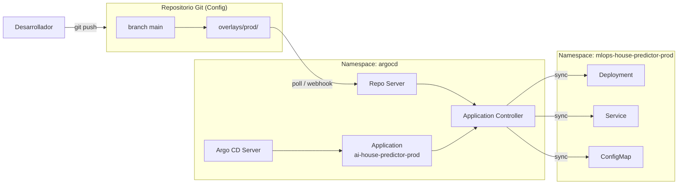

# SPRINT3_REPORT.md

**Proyecto:** MLOps GitOps — TFM UNIR  
**Sprint:** 3 — GitOps con Argo CD  
**Fecha:** 29 de junio de 2026  
**Alcance:** Gobernanza declarativa del despliegue mediante Git (sin GitHub Actions ni MLflow)

---

## 1. Arquitectura GitOps final



### Principio GitOps aplicado

| Antes (Sprint 2) | Ahora (Sprint 3) |
|---|---|
| `kubectl apply -k` manual | **Git** como única fuente de verdad |
| Drift no detectado | **selfHeal** corrige desviaciones |
| Recursos huérfanos posibles | **prune** elimina recursos obsoletos |
| Sin historial de despliegue | Historial en **Git + Argo CD** |

---

## 2. Application manifest

Archivo: [`argocd/application.yaml`](argocd/application.yaml)

```yaml
apiVersion: argoproj.io/v1alpha1
kind: Application
metadata:
  name: ai-house-predictor-prod
  namespace: argocd
spec:
  project: default
  source:
    repoURL: https://github.com/rcazorla766/Config.git
    targetRevision: main
    path: overlays/prod
  destination:
    server: https://kubernetes.default.svc
    namespace: mlops-house-predictor-prod
  syncPolicy:
    automated:
      prune: true
      selfHeal: true
    syncOptions:
      - CreateNamespace=true
```

**Bootstrap único permitido:**

```bash
kubectl apply -f argocd/application.yaml
```

---

## 3. Instalación y verificación de Argo CD

### Instalación

```bash
kubectl create namespace argocd
kubectl apply -n argocd -f https://raw.githubusercontent.com/argoproj/argo-cd/stable/manifests/install.yaml
```

### Componentes verificados

| Componente | Tipo | Estado |
|---|---|---|
| argocd-server | Deployment | ✅ Running |
| argocd-application-controller | StatefulSet | ✅ Running |
| argocd-repo-server | Deployment | ✅ Running |
| argocd-redis | Deployment | ✅ Running |
| argocd-dex-server | Deployment | ✅ Running |
| argocd-notifications-controller | Deployment | ✅ Running |
| argocd-applicationset-controller | Deployment | ⚠ CrashLoopBackOff (CRD no instalado) |

> El ApplicationSet controller no es necesario para este TFM. La Application funciona correctamente sin él.

### Acceso UI

```bash
kubectl -n argocd port-forward svc/argocd-server 8443:443
```

| Parámetro | Valor |
|---|---|
| URL | https://localhost:8443 |
| Usuario | `admin` |
| Contraseña | `kubectl -n argocd get secret argocd-initial-admin-secret -o jsonpath="{.data.password}" \| base64 -d` |

### Interfaz Argo CD (descripción para captura)

En la UI debe observarse:

- **Application:** `ai-house-predictor-prod`
- **Sync Status:** `Synced` (verde)
- **Health Status:** `Healthy` (verde)
- **Repository:** `https://github.com/rcazorla766/Config.git`
- **Path:** `overlays/prod`
- **Revision:** commit SHA de `main`
- **Resources:** Namespace, ConfigMap, Service, Deployment

---

## 4. Estado final de la Application

```text
$ kubectl -n argocd get applications

NAME                      SYNC STATUS   HEALTH STATUS   REVISION
ai-house-predictor-prod   Synced        Healthy         6ea24f4...
```

```text
$ kubectl -n mlops-house-predictor-prod get all

NAME                                      READY   STATUS    RESTARTS   AGE
pod/ai-house-predictor-85965b95cc-*       1/1     Running   0          ...

NAME                         TYPE        CLUSTER-IP     PORT(S)
service/ai-house-predictor   ClusterIP   10.43.x.x     80/TCP

NAME                                 READY   UP-TO-DATE   AVAILABLE
deployment.apps/ai-house-predictor   3/3     3            3
```

---

## 5. Pruebas GitOps ejecutadas

### Prueba 1 — Cambio de réplicas (Git → Sync)

| Paso | Acción | Resultado |
|---|---|---|
| 1 | Modificar `overlays/prod/deployment-patch.yaml`: `replicas: 2 → 3` | ✅ |
| 2 | `git commit` + `git push origin main` | ✅ |
| 3 | Argo CD sincroniza | ✅ `Synced` |
| 4 | Verificar clúster | ✅ `replicas=3`, 3 pods Running |

```text
commit: 46ff6d6 test(gitops): increase prod replicas to 3
```

---

### Prueba 2 — Cambio de ConfigMap (Git → Sync)

| Paso | Acción | Resultado |
|---|---|---|
| 1 | Modificar `LOG_LEVEL: warning → info` | ✅ |
| 2 | `git commit` + `git push` | ✅ |
| 3 | Argo CD sincroniza ConfigMap | ✅ |
| 4 | Verificar | ✅ `kubectl get cm ... LOG_LEVEL=info` |

```text
commit: 976fd19 test(gitops): change prod LOG_LEVEL to info
```

---

### Prueba 3 — Cambio de imagen (Rolling Update)

| Paso | Acción | Resultado |
|---|---|---|
| 1 | `newTag: "1.0.0" → "1.0.1"` en `overlays/prod/kustomization.yaml` | ✅ |
| 2 | Build + import imagen `ai-house-predictor:1.0.1` en nodo k3s | ✅ |
| 3 | `git commit` + `git push` | ✅ |
| 4 | Argo CD sync + rollout | ✅ |
| 5 | Verificar imagen | ✅ `ai-house-predictor:1.0.1` |

```text
$ kubectl rollout status deployment/ai-house-predictor -n mlops-house-predictor-prod
deployment "ai-house-predictor" successfully rolled out

$ kubectl get deploy -o jsonpath='{.spec.template.spec.containers[0].image}'
ai-house-predictor:1.0.1
```

---

### Prueba 4 — Configuration drift + self-healing

| Paso | Acción | Resultado |
|---|---|---|
| 1 | `kubectl scale deployment ai-house-predictor --replicas=1` | Drift manual |
| 2 | Estado inmediato | ✅ `sync=OutOfSync`, `replicas=1` |
| 3 | Esperar reconciliación (~35s) | ✅ `Synced`, `replicas=3` |

**Evidencia drift detection:**

```text
replicas=1 sync=OutOfSync    ← drift detectado
...
SYNC STATUS: Synced            ← self-heal completado
replicas=3                   ← estado restaurado desde Git
```

---

### Prueba 5 — Rollback mediante Git

| Paso | Acción | Resultado |
|---|---|---|
| 1 | `git revert` del commit de imagen 1.0.1 | ✅ |
| 2 | `git push origin main` | ✅ |
| 3 | Argo CD sincroniza | ✅ `revision: 6ea24f4` |
| 4 | Verificar imagen | ✅ `ai-house-predictor:1.0.0` |

```text
$ git revert --no-edit HEAD
$ git push origin main

$ kubectl get deploy -o jsonpath='{.spec.template.spec.containers[0].image}'
ai-house-predictor:1.0.0
```

---

## 6. Verificación funcional API (post-GitOps)

```text
$ kubectl port-forward svc/ai-house-predictor 18081:80 -n mlops-house-predictor-prod

GET /health → {"status":"healthy"}
GET /ready  → {"status":"ready","model_loaded":true,"model_version":"v1"}
```

---

## 7. Logs relevantes de Argo CD

```json
{"msg":"Comparing app state (cluster: https://kubernetes.default.svc, namespace: mlops-house-predictor-prod)"}
{"msg":"Initiated automated sync to 'f643a78...'"}
{"msg":"Sync operation to f643a78... succeeded"}
{"msg":"Updated sync status: OutOfSync -> Synced"}
{"msg":"Updated health status: Progressing -> Healthy"}
{"msg":"Reconciliation completed"}
```

Eventos de la Application:

```text
Normal  OperationStarted     Initiated automated sync
Normal  OperationCompleted   Sync operation succeeded
Normal  ResourceUpdated      Updated sync status: OutOfSync -> Synced
Normal  ResourceUpdated      Updated health status: Healthy -> Progressing -> Healthy
```

---

## 8. Decisiones técnicas adoptadas

| Decisión | Justificación |
|---|---|
| Repositorio Git separado (`Config`) | Separación app vs configuración (patrón GitOps estándar) |
| `overlays/prod` como path de Argo CD | Multi-entorno con Kustomize sin duplicar manifiestos |
| `prune: true` | Evita recursos huérfanos al eliminar manifests de Git |
| `selfHeal: true` | Corrige drift manual (prueba 4) |
| `CreateNamespace=true` | Argo CD crea el namespace automáticamente |
| `imagePullPolicy: IfNotPresent` | Compatible con imágenes locales en k3s (TFM) |
| Bootstrap Application vía `kubectl apply` | Único `kubectl apply` permitido además de instalar Argo CD |
| Repo HTTPS público | Sin gestión de credenciales SSH en esta fase |
| `revisionHistoryLimit: 5` | Rollback en Kubernetes + rollback en Git |

---

## 9. Problemas encontrados y soluciones

| # | Problema | Solución |
|---|---|---|
| P1 | Sin clúster K8s al inicio | k3s en contenedor Docker (heredado Sprint 2) |
| P2 | CRD ApplicationSet inválido al instalar Argo CD | No bloquea operación; Application funciona sin ApplicationSet |
| P3 | ApplicationSet controller en CrashLoopBackOff | Ignorado; no requerido para este caso |
| P4 | Argo CD poll interval (~3 min) | `kubectl annotate application ... refresh=hard` para demos |
| P5 | `git push` rejected (non-fast-forward) | `git pull --rebase origin main` antes de push |
| P6 | JSON patch en PowerShell falla | Usar `kubectl scale` para prueba de drift |
| P7 | Imagen nueva no disponible en nodo | `docker save` + `ctr images import` en k3s |

---

## 10. Cambios realizados en Sprint 3

| Archivo / Recurso | Cambio |
|---|---|
| `argocd/application.yaml` | Application con auto-sync prod |
| `argocd/project.yaml` | AppProject para futuros entornos |
| `Config/README.md` | Sección GitOps con Argo CD |
| `App/README.md` | Sección GitOps con Argo CD |
| Namespace `argocd` | Argo CD instalado |
| Namespace `mlops-house-predictor-prod` | Gestionado por Argo CD |

---

## 11. Restricciones respetadas

- ❌ No se instaló Flux ni Helm
- ❌ No se implementó GitHub Actions
- ❌ No se implementó MLflow
- ❌ No se usa `kubectl apply -k` para la aplicación
- ✅ Solo `kubectl apply` para instalar Argo CD y bootstrap de Application

---

## 12. Preparación Sprint 4

| Tarea futura | Descripción |
|---|---|
| GitHub Actions | CI build imagen → actualizar tag en `overlays/prod` |
| MLflow | Registro de modelos externo al Git |
| Sealed Secrets | Sustituir `secret.example.yaml` |
| Image Updater | Argo CD Image Updater o pipeline CD |
| Ingress | Exposición externa de Argo CD y API |

---

## 13. Conclusión

El Sprint 3 cumple el objetivo: el ciclo de vida del despliegue ML está **completamente gobernado por Git** mediante Argo CD.

- Application **Healthy** y **Synced**
- Sincronización automática verificada (réplicas, ConfigMap, imagen)
- **Drift detection** y **self-healing** demostrados
- **Rollback** mediante `git revert` restaura el estado anterior

**Estado:** ✅ Completado — listo para CI/CD automatizado (Sprint 4).
